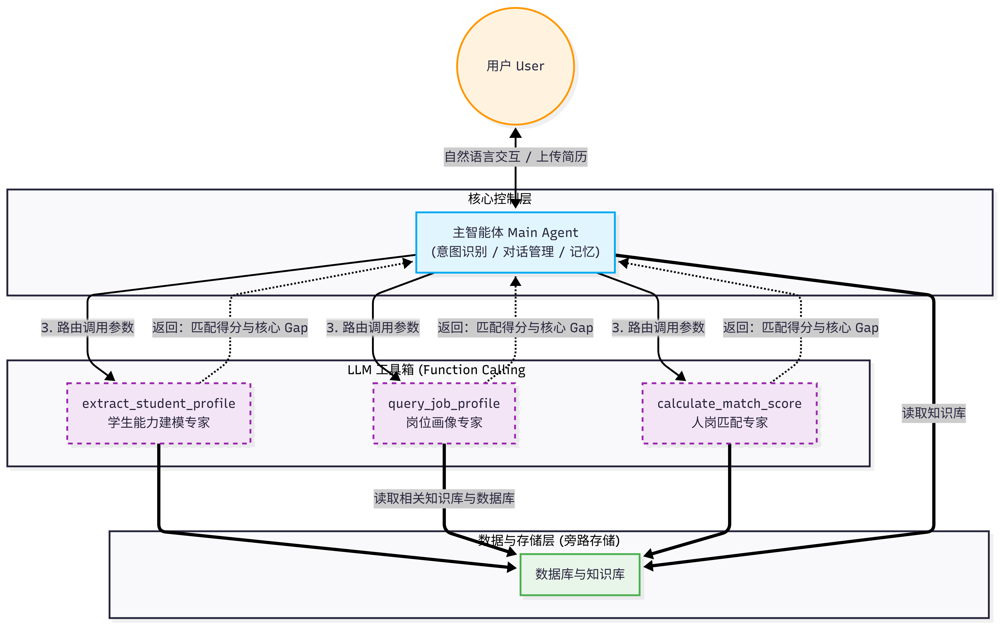

# CareerPlanningAgent 职业规划智能体系统

CareerPlanningAgent 是一个基于 **Single Agent + Tools (ReAct)** 架构构建的职业规划助手。它利用大模型的推理与决策能力，通过调用多个专家工具，为用户提供简历分析、岗位画像检索及人岗匹配建议。



## 前置知识

我们复用了之前开发的学生能力建模模块，岗位画像建模模块，人岗匹配模块。

[学生能力建模专家](https://github.com/Junfeng-Pan/studentprofile-agent.git)

[岗位建模专家](https://github.com/Junfeng-Pan/job-system.git)

[人岗匹配专家](https://github.com/Junfeng-Pan/matching_engine.git)


## 🌟 核心特性

- **ReAct 推理循环**：主智能体采用“思考-行动-观察” (Thought-Action-Observation) 循环，自主规划任务路径。
- **三级岗位画像检索**：
  1. **Tier 1 (MySQL)**: 优先检索已人工审核或批量生成的画像特征。
  2. **Tier 2 (RAG)**: 在 9000+ 岗位知识库中基于向量相似度进行实时检索。
  3. **Tier 3 (LLM)**: 若前两级均未命中，则利用 LLM 的通用行业知识生成基准画像。
- **Agentic RAG**：主智能体可主动检索职业规划知识库，获取面试技巧、行业趋势等通用建议。
- **流式实时反馈**：所有专家工具调用及主智能体思考过程均支持 Token 级的流式输出。

## 📂 项目结构

```text
D:\pythonP\Professional_workplace\CareerPlanningAgent\
├───database\             # 统一数据存储层 (MySQL & KnowledgeBase)
├───main_agent\           # 主智能体逻辑 (ReAct 工作流、工具定义)
├───job_system\           # 岗位画像专家服务
├───matching_engine\      # 人岗匹配算法服务
├───studentprofile_agent\ # 学生简历分析服务
├───data\                 # 持久化数据 (ChromaDB, SQLite, 忽略上传)
├───config\               # 配置文件
└───tests\                # 全流程与单元测试
```

## 🛠️ 环境搭建

1. **安装依赖**：
   本项目现已统一为单包管理，您只需在项目根目录下运行：
   ```bash
   pip install -e .
   ```
   *注意：若需安装特定依赖，请参考 pyproject.toml 中的 dependencies 列表。*

2. **配置环境变量**：
   在根目录下创建 `.env` 文件，配置如下参数：
   ```env
   DASHSCOPE_API_KEY=your_api_key_here
   DASHSCOPE_BASE_URL=https://dashscope.aliyuncs.com/compatible-mode/v1
   DASHSCOPE_MODEL_NAME=qwen3.5-plus
   ```

3. **数据库初始化**：
   - 执行 `database/mysql/init_db.sql` 初始化 MySQL 表结构。
   - 运行 `database/knowledgebase/rag_service.py` 初始化向量知识库。

## 🚀 快速开始

运行全流程测试脚本，观察主智能体的推理过程：
```bash
python tests/test_main_agent.py
```

## 工作总结

* 目前只是实现了粗略的框架，三个子模块（学生能力建模专家，岗位画像专家，人岗匹配专家）需要重新设计。
* 职业规划，路径规划系统还没有实现。
* 主智能体需要的知识库，岗位画像专家需要的知识库和数据库没有配置。
